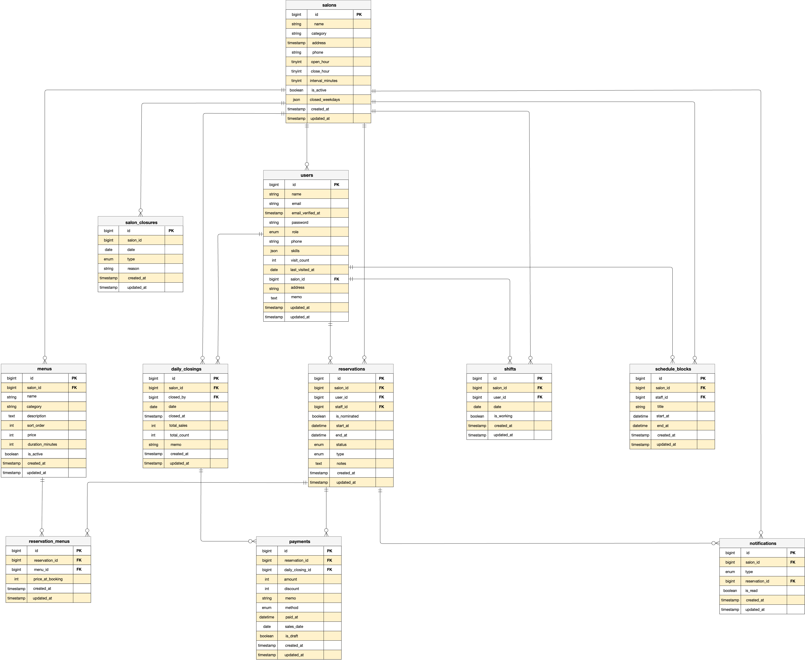

# Salon Board Mini

こちらのアプリは、美容サロン向け予約・売上管理システムです。

スタッフ用ダッシュボード、予約管理、会計・レジ締め機能などを備えています。

#### 主な機能は以下の通りです。

【スタッフ向け】
* ダッシュボード - 当日予約・売上サマリー・レジ締め（日付ナビゲーション対応）
* タイムテーブル - スタッフ別予約をドラッグ&ドロップで移動・リサイズ
* 予約管理 - 予約の作成・編集・キャンセル・スケジュールブロック管理
* 会計 - 会計確定・割引・支払い方法管理
* レジ締め - 日次売上集計・レジ締め後会計の自動繰り越し
* 顧客管理 - 顧客検索・来店履歴・来店回数管理
* 予約一覧 - 日付・ステータス・担当者・顧客名でフィルタリング・ページネーション

【お客様向け】
* ネット予約 - サロン選択・メニュー選択・スタッフ指名・予約作成
* 予約確認・キャンセル


環境構築の詳細を以下に記載しております。

尚、Docker環境を使用しております。

## 環境構築

#### リポジトリをクローン

```
git clone git@github.com:ks-kanae/salon-board_mini.git

cd salon-board-mini/laravel-next-app
```

#### .env ファイルの作成

```
cp .env.example .env
```

#### .env ファイルの修正

```
APP_URL=http://localhost
APP_LOCALE=ja
APP_FALLBACK_LOCALE=en
```
```
DB_CONNECTION=mysql
- DB_HOST=127.0.0.1
+ DB_HOST=mysql
DB_PORT=3306
- DB_DATABASE=laravel
- DB_USERNAME=root
- DB_PASSWORD=
+ DB_DATABASE=laravel_next_app
+ DB_USERNAME=sail
+ DB_PASSWORD=password
```
```
MAIL_MAILER=smtp
MAIL_HOST=mailpit
MAIL_PORT=1025
MAIL_USERNAME=null
MAIL_PASSWORD=null
MAIL_ENCRYPTION=null
- MAIL_FROM_ADDRESS=null
+ MAIL_FROM_ADDRESS="hello@example.com"
MAIL_FROM_NAME="${APP_NAME}"
```
```
FRONTEND_URL=http://localhost:3000
SANCTUM_STATEFUL_DOMAINS=localhost:3000
CORS_SUPPORTS_CREDENTIALS=true
```
```
(ソーシャルログイン用の キーを追加)
GOOGLE_CLIENT_ID=○○○○○○○○
GOOGLE_CLIENT_SECRET=○○○○○○○○
GOOGLE_REDIRECT_URI=○○○○○○○○

GITHUB_CLIENT_ID=○○○○○○○○
GITHUB_CLIENT_SECRET=○○○○○○○○
GITHUB_REDIRECT_URI=○○○○○○○○
```

#### composerインストール

```
docker run --rm -v $(pwd):/app composer install
```

#### laravel Sailを起動

```
./vendor/bin/sail up -d
```

#### キー生成

```
./vendor/bin/sail artisan key:generate
```

#### マイグレーション・シーディングを実行

```
./vendor/bin/sail artisan migrate:fresh --seed
```

#### Next.jsセットアップ

```
cd ../next-frontend-app

(環境変数ファイルを作成)
echo "NEXT_PUBLIC_API_BASE_URL=http://localhost" > .env.local

```

#### パッケージインストール

```
npm install
```
#### 開発サーバー起動

```
npm run dev
```

#### ストレージリンクの作成

```
php artisan storage:link
(PHPコンテナ上で実行)
```

## 使用技術（実行環境）

バックエンド：Laravel 10 / PHP 8.1

フロントエンド：Next.js 14 / TypeScript / Tailwind CSS

データベース：MySQL 8.0.36

認証：Laravel Sanctum

開発環境：Laravel Sail (Docker)


## ER図



## URL

アプリケーション：http://localhost:3000

Laravel API：http://localhost

Mailpit(メール確認)：http://localhost:8025/
  ※ 開発環境ではメール認証メールは Mailpit に送信されます

## ダミーデータ一覧

## シーダーで生成されるデータ

* サロン: 3店舗（マツエク・ネイル・ヘア）
* スタッフ: 各店舗3名（計9名）
* お客様: 10名
* 予約: 過去2週間〜未来2週間のダミー予約
* レジ締め: 過去14日分（毎日18:00）
* 会計: レジ締め後会計を含むダミーデータ

---

### スタッフアカウント

| サロン | メールアドレス | パスワード | ユーザー名 |
|---|---|---|---|
| マツエクサロン | staff.eyelash.a@example.com | password | スタッフ マツエク A |
| ネイルサロン | staff.nail.a@example.com | password | スタッフ ネイル A |
| ヘアサロン | staff.hair.a@example.com | password | スタッフ ヘア A |

### お客様アカウント

| メールアドレス | パスワード | ユーザー名 |
|---|---|---|
| test@example.com | password | テストユーザー |
| test1@example.com | password | 山田 花子 |
| test2@example.com | password | 佐藤 美咲 |
| test3@example.com | password | 鈴木 さくら |
| test4@example.com | password | 田中 優子 |
| test5@example.com | password | 伊藤 真由 |
| test6@example.com | password | 渡辺 あおい |
| test7@example.com | password | 中村 りな |
| test8@example.com | password | 小林 ゆか |
| test9@example.com | password | 加藤 なな |
